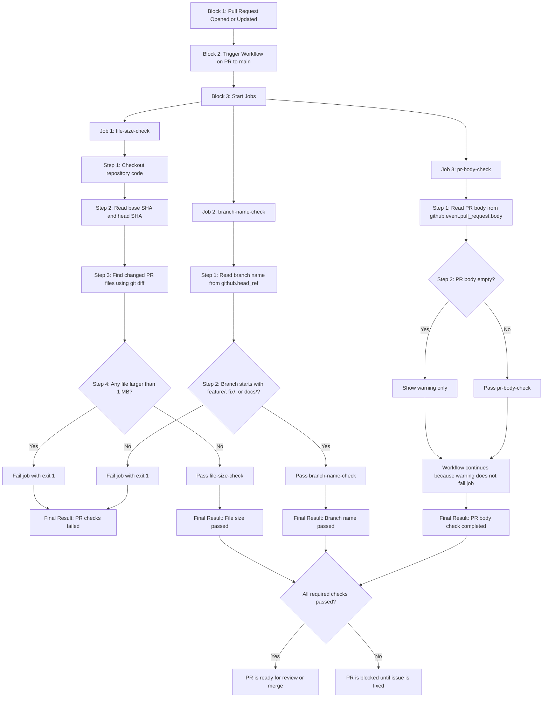

# Day 47 Task 2 – PR Validation Workflow Mermaid Flowchart

## Task Name

**PR Validation Workflow**

File path:

```bash
.github/workflows/pr-checks.yml
```

---

## Goal of This Workflow

This workflow acts like a **real-world Pull Request gate**.

It checks a pull request before it is merged into the `main` branch.

The workflow validates:

1. Changed file sizes
2. Branch naming rule
3. Pull request description/body

---

## Mermaid Flowchart



---

# Block-by-Block Explanation

## Block 1: Pull Request Opened or Updated

The workflow starts when someone opens, updates, reopens, or synchronizes a pull request.

Example:

```yaml
on:
  pull_request:
    branches:
      - main
```

This means the workflow runs only when a pull request targets the `main` branch.

---

## Block 2: Trigger Workflow on PR to main

GitHub Actions checks the event type.

If the event is a pull request going into `main`, the workflow starts.

This is useful because teams usually protect the `main` branch and validate changes before merging.

---

## Block 3: Start Jobs

The workflow has three jobs:

```yaml
jobs:
  file-size-check:
  branch-name-check:
  pr-body-check:
```

Each job checks a different rule.

---

# Job 1: file-size-check

## Purpose

This job checks whether any changed file in the pull request is larger than **1 MB**.

If any file is larger than 1 MB, the job fails.

---

## Step 1: Checkout repository code

```yaml
- name: Checkout code
  uses: actions/checkout@v4
```

This downloads the repository files into the GitHub Actions runner.

Without checkout, the workflow cannot inspect the changed files.

---

## Step 2: Read base SHA and head SHA

```bash
BASE_SHA="${{ github.event.pull_request.base.sha }}"
HEAD_SHA="${{ github.event.pull_request.head.sha }}"
```

### Meaning

| Variable | Meaning |
|---|---|
| `BASE_SHA` | The commit from the target branch, usually `main` |
| `HEAD_SHA` | The latest commit from the pull request branch |

These two values help Git compare what changed in the PR.

---

## Step 3: Find changed PR files

```bash
files=$(git diff --name-only --diff-filter=ACMRT "$BASE_SHA" "$HEAD_SHA")
```

### Meaning

This command lists files changed between the base branch and the pull request branch.

`--diff-filter=ACMRT` includes files that are:

| Letter | Meaning |
|---|---|
| A | Added |
| C | Copied |
| M | Modified |
| R | Renamed |
| T | Type changed |

Deleted files are not checked because they no longer exist in the working directory.

---

## Step 4: Check each file size

```bash
size=$(stat -c%s "$file")
```

This command gets the file size in bytes.

The workflow compares the size with:

```bash
1048576
```

`1048576` bytes equals **1 MB**.

---

## Step 5: Fail if file is larger than 1 MB

```bash
if [ "$size" -gt 1048576 ]; then
  echo "Error: $file is larger than 1 MB"
  failed=1
fi
```

If a file is larger than 1 MB, the workflow marks it as failed.

At the end:

```bash
exit 1
```

This makes the GitHub Actions job fail.

---

# Job 2: branch-name-check

## Purpose

This job checks whether the branch name follows the required naming pattern.

Allowed patterns:

```text
feature/*
fix/*
docs/*
```

Examples:

```text
feature/add-login
fix/button-error
docs/update-readme
```

---

## Step 1: Read branch name

```bash
branch_name="${{ github.head_ref }}"
```

### Meaning

`github.head_ref` gives the source branch name of the pull request.

Example:

```text
feature/add-login
```

Important note:

`github.head_ref` is mainly used with pull request events.

---

## Step 2: Validate branch pattern

```bash
if [[ "$branch_name" =~ ^(feature|fix|docs)/.+ ]]; then
  echo "Branch name is valid."
else
  echo "Error: branch name must start with feature/, fix/, or docs/"
  exit 1
fi
```

### Meaning

This regex checks whether the branch starts with:

```text
feature/
fix/
docs/
```

The `.+` means there must be something after the slash.

So this is valid:

```text
feature/add-login
```

But this is not valid:

```text
feature/
```

And this is also not valid:

```text
test/bad-branch
```

---

## Step 3: Fail bad branch name

If the branch name is invalid, the job runs:

```bash
exit 1
```

This fails the job and blocks the pull request check.

---

# Job 3: pr-body-check

## Purpose

This job checks whether the pull request description is empty.

But this job should only show a warning.

It should **not fail** the workflow.

---

## Step 1: Read PR body

```yaml
env:
  PR_BODY: ${{ github.event.pull_request.body }}
```

### Meaning

This stores the pull request body/description in an environment variable called `PR_BODY`.

---

## Step 2: Check if PR body is empty

```bash
if [ -z "$(echo "$PR_BODY" | tr -d '[:space:]')" ]; then
  echo "::warning::PR description is empty. Please add a clear description."
else
  echo "PR description is present."
fi
```

### Meaning

This removes spaces, tabs, and new lines from the PR body.

If nothing remains, the PR description is considered empty.

---

## Step 3: Show warning only

```bash
echo "::warning::PR description is empty. Please add a clear description."
```

This creates a GitHub Actions warning.

The job still passes because there is no:

```bash
exit 1
```

---

# Final Result

## If everything is correct

The pull request checks pass.

The PR can be reviewed or merged depending on repository rules.

---

## If file size is larger than 1 MB

The `file-size-check` job fails.

The PR is blocked.

---

## If branch name is wrong

The `branch-name-check` job fails.

The PR is blocked.

Example bad branch:

```text
test/bad-branch
```

Expected result:

```text
branch-name-check fails
```

---

## If PR body is empty

The `pr-body-check` job shows a warning.

The PR is not blocked.

---

# Complete Workflow Code

```yaml
name: PR Validation Checks d47 t2

on:
  pull_request:
    branches:
      - main

jobs:
  file-size-check:
    name: File Size Check
    runs-on: ubuntu-latest

    steps:
      - name: Checkout code
        uses: actions/checkout@v4
        with:
          fetch-depth: 0

      - name: Fail if any PR file is larger than 1 MB
        run: |
          echo "Checking changed files in this pull request..."

          BASE_SHA="${{ github.event.pull_request.base.sha }}"
          HEAD_SHA="${{ github.event.pull_request.head.sha }}"

          echo "Base SHA: $BASE_SHA"
          echo "Head SHA: $HEAD_SHA"

          files=$(git diff --name-only --diff-filter=ACMRT "$BASE_SHA" "$HEAD_SHA")

          if [ -z "$files" ]; then
            echo "No changed files found."
            exit 0
          fi

          failed=0

          while IFS= read -r file
          do
            if [ -f "$file" ]; then
              size=$(stat -c%s "$file")
              echo "$file size: $size bytes"

              if [ "$size" -gt 1048576 ]; then
                echo "Error: $file is larger than 1 MB"
                failed=1
              fi
            fi
          done <<< "$files"

          if [ "$failed" -eq 1 ]; then
            echo "One or more files are larger than 1 MB."
            exit 1
          fi

          echo "All changed files are under 1 MB."

  branch-name-check:
    name: Branch Name Check
    runs-on: ubuntu-latest

    steps:
      - name: Validate branch name
        run: |
          branch_name="${{ github.head_ref }}"
          echo "Branch name: $branch_name"

          if [[ "$branch_name" =~ ^(feature|fix|docs)/.+ ]]; then
            echo "Branch name is valid."
          else
            echo "Error: branch name must start with feature/, fix/, or docs/"
            echo "Examples:"
            echo "feature/add-login"
            echo "fix/button-error"
            echo "docs/update-readme"
            exit 1
          fi

  pr-body-check:
    name: PR Body Check
    runs-on: ubuntu-latest

    steps:
      - name: Warn if PR description is empty
        env:
          PR_BODY: ${{ github.event.pull_request.body }}
        run: |
          if [ -z "$(echo "$PR_BODY" | tr -d '[:space:]')" ]; then
            echo "::warning::PR description is empty. Please add a clear description."
          else
            echo "PR description is present."
          fi
```

---

# Verification Steps

## Step 1: Create a badly named branch

```bash
git checkout -b test/bad-branch
```

---

## Step 2: Make a small change

```bash
echo "testing PR checks" >> test.txt
```

---

## Step 3: Add and commit

```bash
git add .
git commit -m "test PR validation workflow"
```

---

## Step 4: Push the branch

```bash
git push -u origin test/bad-branch
```

---

## Step 5: Open PR into main

Go to GitHub and open a pull request from:

```text
test/bad-branch
```

into:

```text
main
```

---

## Expected Result

The `branch-name-check` job should fail because the branch does not start with:

```text
feature/
fix/
docs/
```

---

# One-Line Summary

This workflow protects the `main` branch by checking file size, branch naming rules, and PR description quality before allowing a pull request to pass.
